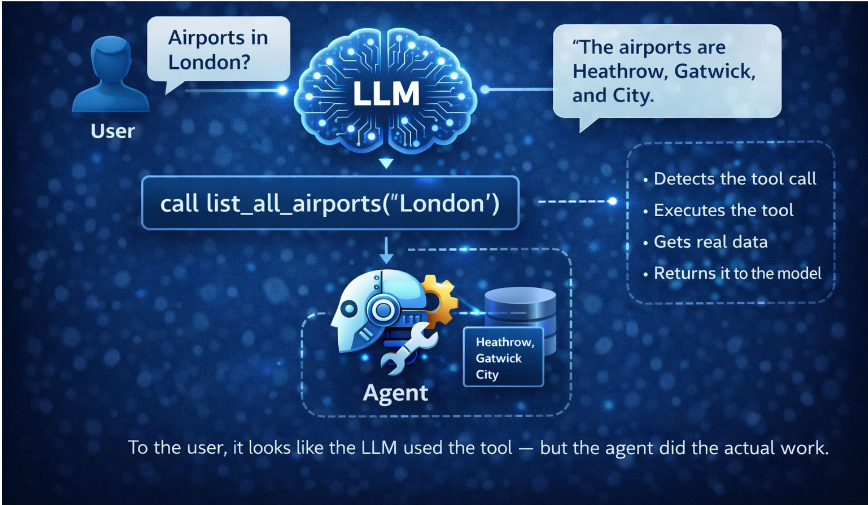
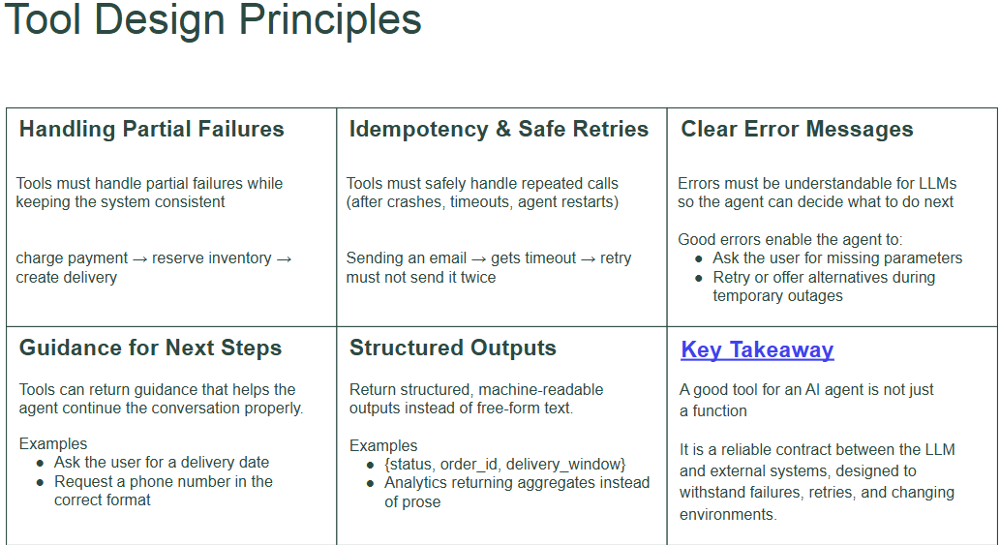
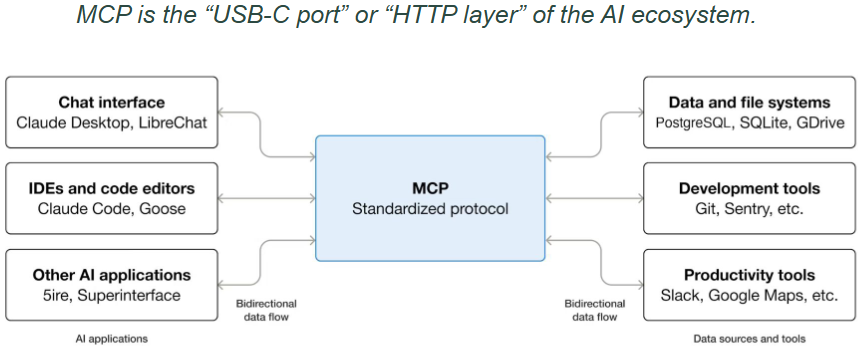
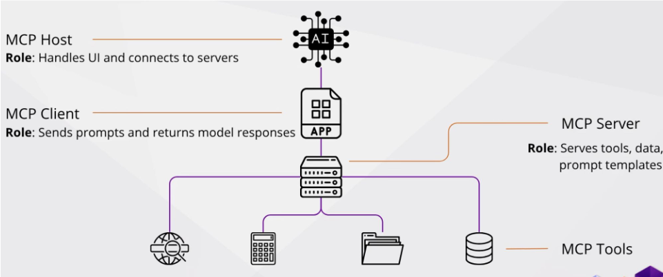
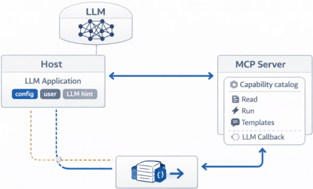
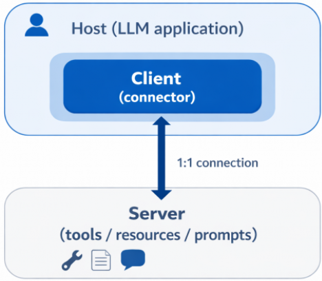
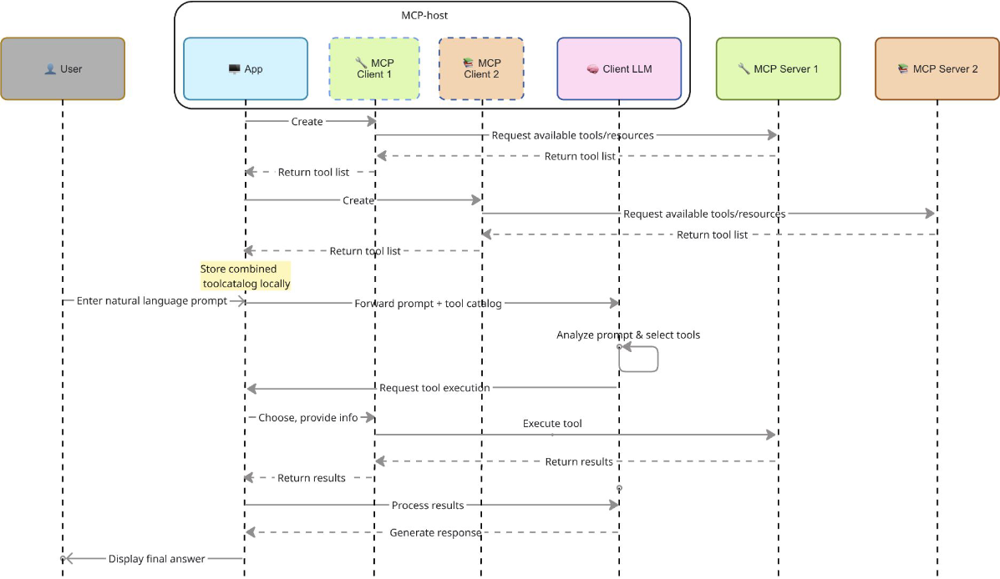
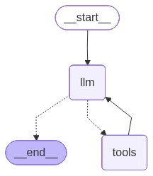

# Tools, MCP
Video: https://www.youtube.com/live/VctYHtCap3o
Materials: https://disk.yandex.ru/d/UYvdXggOw8bNtA

## Tools
Tool = function, given to LLM

Each tool should include:
1. text description --- what it does
2. runtime implementation --- executable function --- how it does
3. input arguments (with types)
4. output (with type)

**How tool calling works**
At some poitn of dialogue (or text generation) the model understands it should call a function to server the user.

So, it generates a json = tool call.
We (in a runtime) should:
1. recognize the model wants to call the tool
2. execute the function with the provided by LLM parameters
3. pass into the LLM




**How to provide tools to LLM**
1. The model is informed about available tools --- via **system prompt**
2. Model can generate tool calls by default (was pretrained on it).
3. Model should understand the tool. So, tool descriptions must be clear!

**Tool design principles**
1. Handling Partial Failures
    - Одно пользовательское действие намерение приводит к цепочке действий в **нескольких** системах
    - В этих системах действия могут быть выполнены лишь частично или **неуспешно**!
    - charge payment --> reserve inventory --> create delivery [если пользователь что-то покупает]
2. Idempotency & Safe Retries
    - Должен успешно обрабатывать повторные вызовы (после падений, timeouts, agent restarts)
    - send email --> gets timeout --> retry не должен отправлять письмо несколько раз!
3. Clear Error Messages
    - Ошибки должны быть понятны для LLM и людей --- чтобы агент мог понять, что делать дальше.
    - Хорошие ошибки позволяют:
        - спрашивать пользователя недостающую информацию
        - перезппуститься на альтернативах
4. Guidance for Next Steps
    - В выходе работы инструмента также можно передать guides, как **дальше** взаимодействовать с пользователем:
        - доспросить у пользователя данные для вызова tool-ов
        - 

5. Structured Outputs



## MCP
MCP = model context protocol ([MCP: от нуля к единице](https://habr.com/ru/articles/1005028/))
When it is needed:

Tools are embedded inside each agent, their API may change over time AND: different models expect tools/invoke them in different formats.

So, any API change would require updating multiple agents --- BAD!

MCP is open standart for **birirectional connections**: AI models <---> external systems.



Two options:
1. provide the data/apps through the MCP servers
2. create AI-applications (MCP-clients), which would **connect** to the MCP servers

### MCP Architecture & Roles


**MCP Host**: --- AI applications, which serves as interface to interact with users. They manage the connection to multiple MCP servers, creating MCP-clients for every MCP connection.


--- it coordinates the interaction with AI models


*_Tasks_*:
1. Executes the LLM
2. Manage client's connections (1 MCP client for every MCP server)
3. Controls UI chat
4. User consent: approve for data sharing & tool use

**MCP Client**: --- 1-to-1 with servers. Sends prompt and returns model responce. It is created by *MCP Host* to connect to *MCP server*. 

--- connector between *MCP Host* and *MCP Servers*

*Tasks*:
1. communication by json RPC2 protocol.
2. sends tool calls, process answers.

**MCP Server**: --- light-weight programms, which give the opportunities via standartized protocol.

--- provides context and capabilities to the model

*Tasks*:
1. Register capabilities (gives the host list of available instruments)
2. Processes requiests (via tools) and return results
3. Provide with context (give data from sources)


## The whole processes


1. **Connection establishing**: *MCP Host* connects to *MCP Servers* via separate *MCP Clients*.
2. **Tool exploration**: each *MCP Client* asks from the corresponding *MCP Server* info: which tools available? Takes, ans saves them locally (to then give to the agent).
3. **User query execution**:
    a. query from user comes to LLM
    b. LLM decides which tools to call
    c. APP executes the instrument via server
    d. APP gives result back to LLM
    e. Loop

## LangGraph
```python
graph = StateGraph(AgentState)
graph.add_node("llm", llm_node)
graph.add_node("tools", tools_node)

graph.set_entry_point("llm")

# Route to tools if the last AI message contains tool calls; otherwise end
graph.add_conditional_edges("llm", tools_condition, {"tools": "tools", END: END})

# After tools run, go back to the LLM so it can use tool results
graph.add_edge("tools", "llm")
```


Как происходит взаимодействие (цикл исполнения):
1. есть внутреннее состояние (AgentState). К нему также добавляется указание текущей вершины ---> получаем состояние конечного автомата.
2. Каждый раз исполнитель:
    - видит, что находится в вершине `u` с состоянием `AgentState`
    - **исполняет** код вершины на этом состоянии: вызывает `u(AgentState) --> result` и получает `result`. Внутренний процессор: `AgentState + result ---> AgentStateNew`.
    - **переходит** в следующую вершину, выбирая исходящее ребро `(u, v, rule)` (и смотря на их внутреннее правило `rule`). Если `rule(AgentStateNew) == True` --- то переходит в вершину `v` с уже новым `AgentStateNew`. Если ни одного перехда не нашлось (мб, соответствует `END`) --- то переходит в указанную вершину (чаще `END`, но могут быть и другие варианты.).