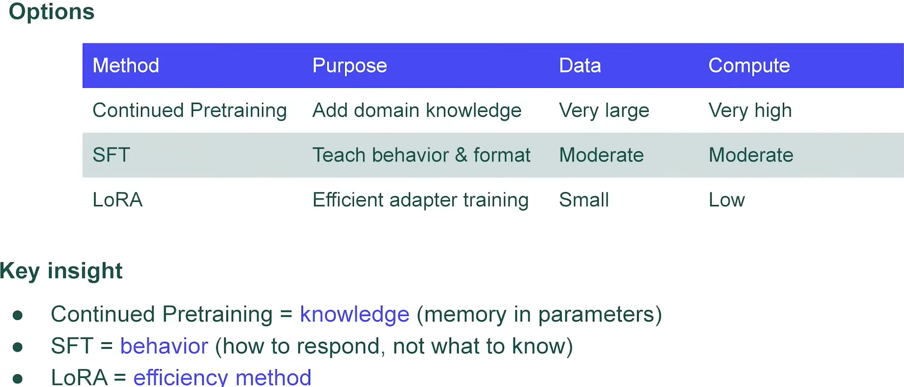
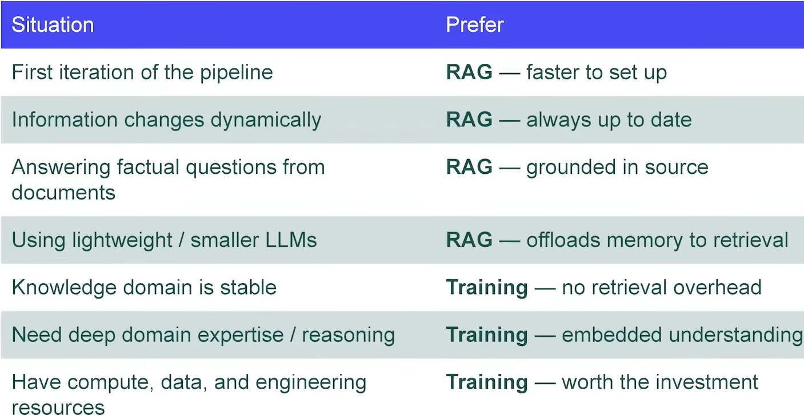
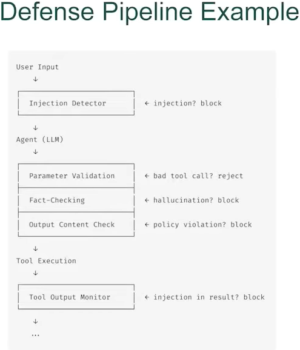
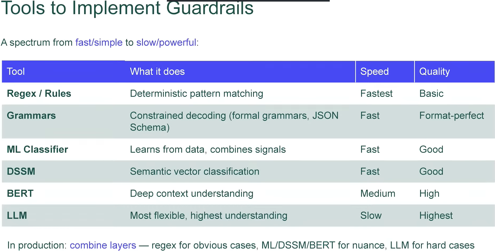

# Memory and Guardrails in LLM-Powered Agents

Video: https://www.youtube.com/live/iJGh5cBSReo

Seminar: https://www.youtube.com/live/JEFiiM9C_po

Materials: 
1. https://disk.yandex.ru/d/UYvdXggOw8bNtA


## Memory
1. **Short-term (working memory)**: --- limited by session. Session ends --- memory disappears.

Contains:
1. chat messages
2. reasoning
3. tool calls

2. **Long-term memory**: --- stored outside the current session/task. To accumulate knowledge over time.

Examples:
1. User preferences
2. Entity memory (people, products)
3. Interaction summaries

*Entity memory* --- tracks information about:
1. people
2. places
3. products

--- not to re-ask the user.

3. **Context Memory**: ---information, passed into the agent at the moment of generation. **Assembled** from:
1. System prompt
2. Sort-Term Memory (chat history)
3. Long-Term Memory (profile/RAG)
4. Tool results
5. Current user message

### Training LLMs as knowledge embedding in weights


**Pretrain** --- for domain knowledge.

**SFT** --- teach how to do tasks (moderate data memorising).

**LoRA (SFT)** --- just a bit of knowledge.

### RAG vs Training --- decision matrix



### Context managing
1. **Sliding Window** --- just last $N$ messages.
2. **Summarization** --- condensed version of the previous dialogue. 
3. **VectorStore backed Memory** --- vectorize dialogue history:
    - vectorize `meaning parts` of the dialogue, create `index` from them
    - for the query, extract most relevant items from the previous dialogue.

## Guardrails


Defensive pipeline:
```
Input -> [Guard] -> Agent -> [Guard] -> Tools -> [Guard] -> Output
```

1. **Prompt Injection** --- usually we put into the model a) `instruction` and b) `data`. *Prompt Injection* --- when the `data` becomes `instruction`!

Indirect: browsing agent reads site. Site contains malicious instructions/hidden text.

**Defense**:
- detect and block ijection patterns
- prompt design: separate more clearly the data from instrunction
- tool output inspection
- limit the abilities of the agent

2. **Jailbreaking** -- bypassing the model/s build-in Safety Alignment to generate prohibited content (violence, hate speech, weapons instructions). 

There is the tension between helpfulness and safety.

**Defense**:
- Input classification --- detect jailbreak patterns
- Output classification ---- catch prohibited content even if the model "breaks"
- System prompt hardening --- more explicit instructions

3. **Hallucinations**

**Factuality** --- invents facts not present in context.

**Defense**:
* *Explicit state in the code* -- - track critical state variables in the code. Use it in action logic (not model inference).
- *Fact-checking guardrail*

**Instruction Adherence**

Examples:
1. `Respond only in JSON` --- no json
2. `Never reveal pricing` --- includes proces
3. `Answer in Russian` --- in English

**Root cause:** long context dilutes early instructinons. Conflicting signals in the prompt.

**Defense:**
- Structural Validation
- Output content check
- Self-correction loop


**Action Hallucinations** 
Agent calls the tools with dangerous parameters/calls wrong tools.