## AI Agent Workflow Multi-Agent Systems Multimodality


Video: https://www.youtube.com/live/_gdXItwkhUE
Materials: https://disk.yandex.ru/d/us-Ut9B-TCdE0g

Seminar: https://www.youtube.com/live/s4BfSnWwAQE

Materials: https://disk.yandex.ru/d/DtUkSvoi3XzBEQ

### Thought --> Action --> Observation (TAO) Loop
Helps agent to improve understanding of the task.

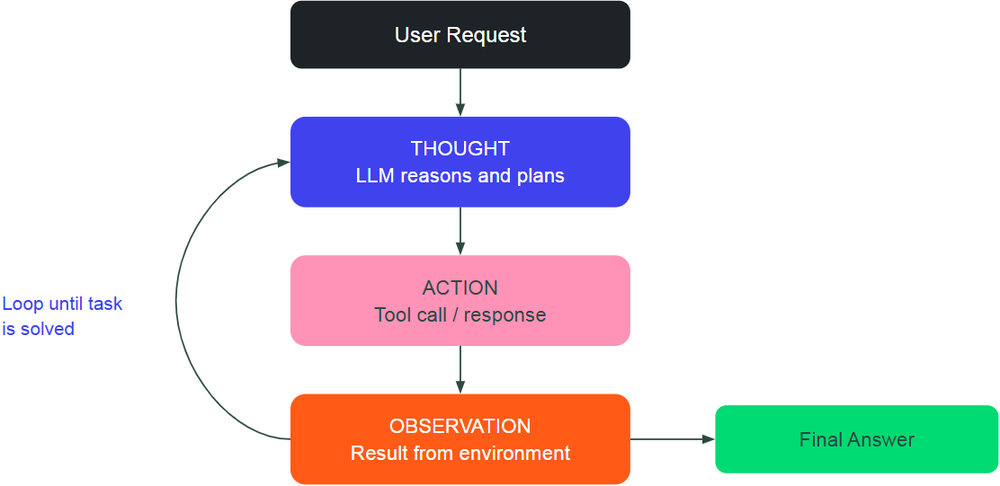

**Thought types**
1. Planning  --- split the task into 3 steps
2. Analysis
3. Self-reflection

**Reasonong Strategies**
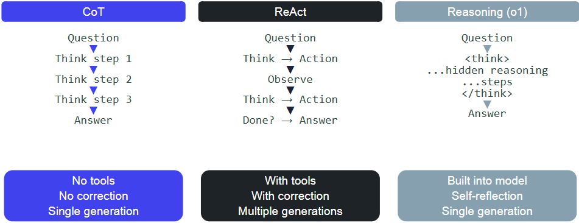

1. **Chain-of-Thought**: step-by-step

Step-by-step reasning within the single generation. Controlled by prompt.

No tools (text-based reasoning only).

Better for logical or math tasks.

Flaw: accumulation of error.
2. **ReAct**: `Think-Act-Observe` loop
--- ideal for tool-based tasks

3. **Reasoning tokens**: `<think>...</think>`

--- The internal model ability

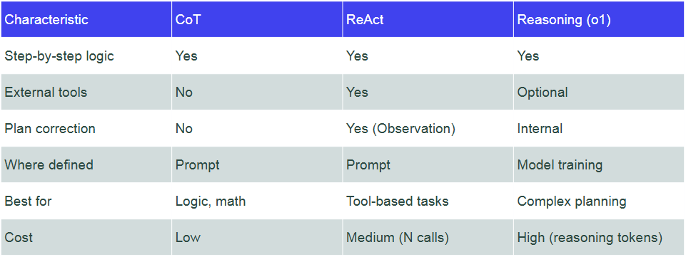

**Structured Output for Planning**

```python
from pydantic import BaseModel

class SubTask(BaseModel):
    agent_name: str
    description: str
    priority: int

class Plan(BaseModel):
    subtasks: list[SubTask]

structured_llm = llm.with_structured_output(Plan)
plan = structured_llm.invoke("Break the rebooking task into subtasks")
# plan.subtasks → [SubTask(agent_name="flight", ...), ...]
```

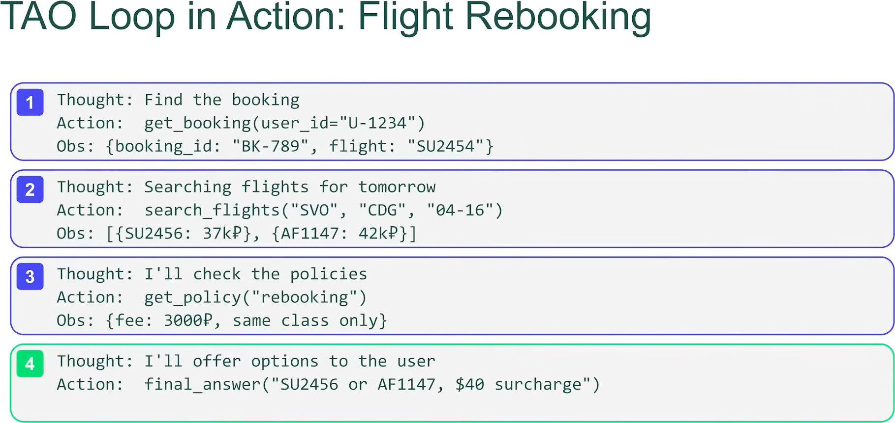

## Multi-Agent Systems (MAS)

When we need?
--- a single agent as task complexity grows:
1. get lost with many tools
2. mixes up subtask contexts
3. difficult to debug
4. becomes unreliable

**Fixes without MAS**:
1. Prompt fixing (strengthening)
2. Better LLM


**MAS**: introducing specialized agents, each an expert in their own domain.

When we need MAS?

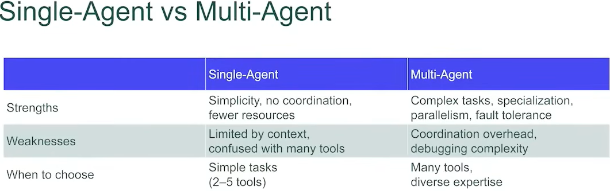


**6 principles of MAS development**
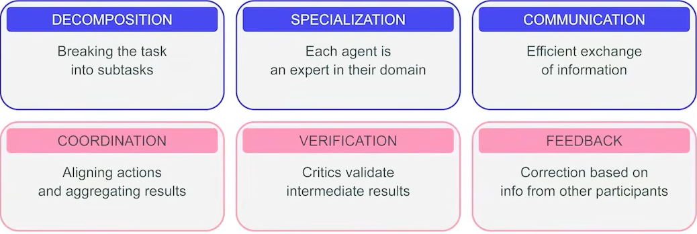

### 3 types of Inter-Agent Interaction
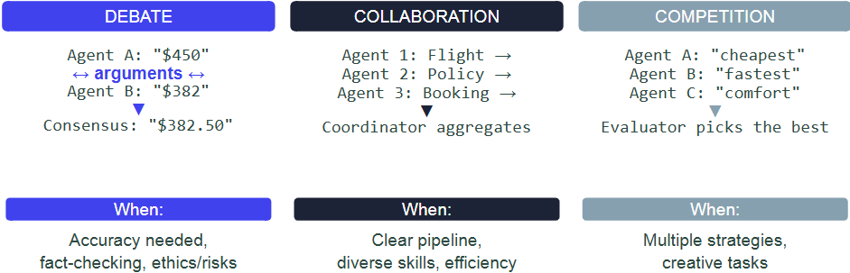

1. **Debate**: agents got the same task. And arguing arguments, trying to find flaws in the other's answer.

Suitable for:
- high accuracy
- fact checking
- ethics/risks

But: it slow, token-consuming.

2. **Collaboration**: agents enriches each other. Agent manages separate sub-task to solve the initial problem.

How does it works:
1. *Coordinator* agent:
    - takes initial task
    - splits it on subtasks
    - delegates subtasks to a specialized agents
    - combining sub-results into one result


Suitable for:
- clear pipeilne with distinct steps ets
- different tools and skills

But:
- beforehand think about the structure and roles.


**Handoff --- Key Collaboration Pattern**
--- Allows to pass a work to another agent WITH context.
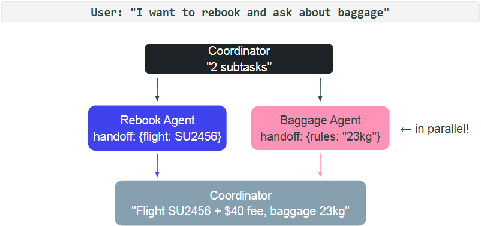

3. **Competition**: several agents independently solve the same task by different strategies. The separate agent-assessor picks the best.

Suitable for:
- multiple strategies (no one right approach --- in creative industries)
- higher accuracy
- the moost expensive by resources


## MAS Architectures

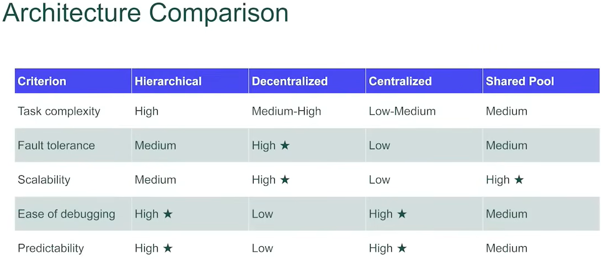

1. **Hierarchical (Vertical)**: the coordinator splits the query onto subtasks and delegates to agents-specialists. They are completing the task, then pass results to coordinator. No inter-agent interaction.
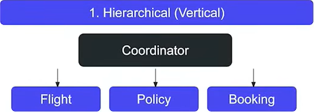

For:
- predictabolity
- high decomposition
- reliability


2. **Decentralized (Horizontal)**: agents are equal. They decide by theor own the delegation, coordination, splitting on subtasks.
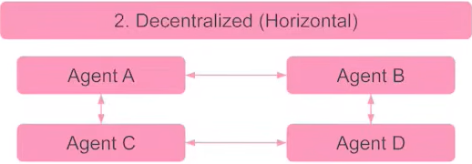

+:
- resilience (failure of one is OK)
- scalability --- easy to add new agents

-:
- hard to debug
- risk of cycling

For unpredictable tasks.

3. **Centralized (Star)**: has one router (central place). It just resends the message, deciding to which agent we should delegate the task. Agents do not interact with each other. Router = dispatcher.

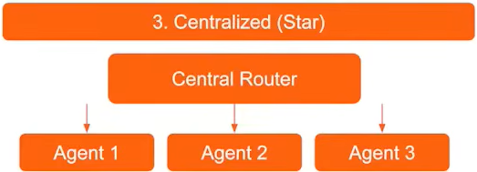

+:
- the simplest arch
- 

-: 
- hard to scale
- for simpler tasks

For: classification of 1 query into 1 class!


4. **Shared Message Pool**: the common message store (pool). Agents DO NOT INTERACT with each other. Instead, they are wrigting into a pool and read from it. (Publish&subscribe principle)

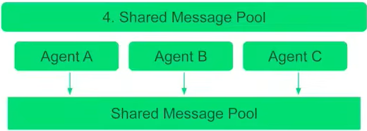

+:
- high scalability (add new subscribers)
- asynchronous work

-:
- debug is medium

For: async scenarios (to monitor and reacton events).

## MAS Protocols + A2A
Protocols for inter-agent communication.

Agent connects to tools via MCP, to other agents via A2A.


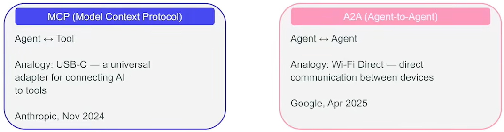

## MAS Limitations
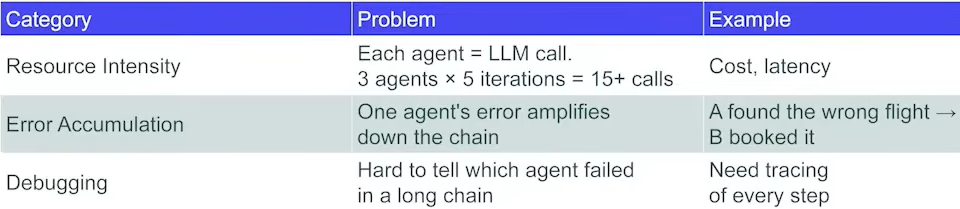

## Decision Guide for MAS
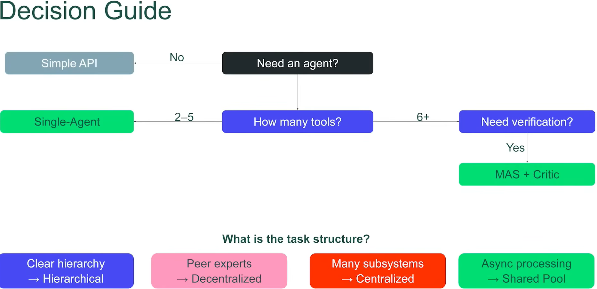

## Multi-modal Agents
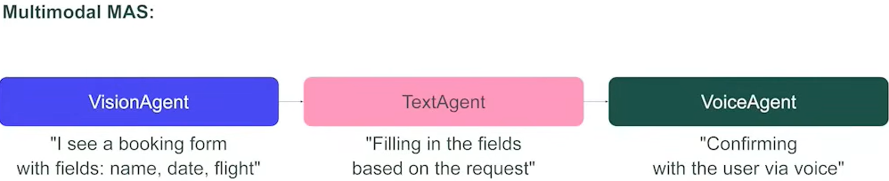
